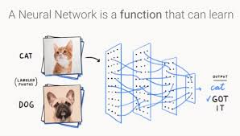
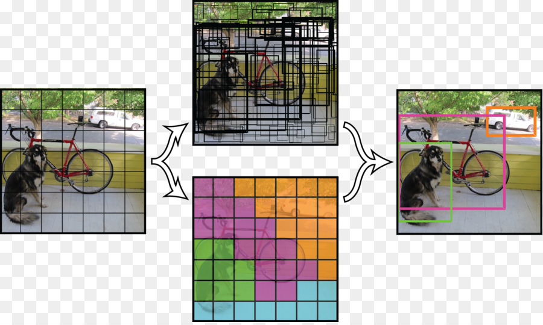

# README #

[](https://pypi.org/project/simple-tensor/)
[]()
[]()
[]()

## NEWS
| Date       |                                                         News                                                                     |     Version       |
| ---------- | -------------------------------------------------------------------------------------------------------------------------------- | ----------------- |  
|Sept 2019   | face recognition (insight face) was released for inferencing (STABLE), for training will available in the future version         | >= v0.7.4         |
|August 2019 | deeplab semantic segmentation (PREVIEW version)was released                                                                      | >= v0.6.10        |
|Mei 2019    | yolov3 object detection (STABLE version) was relesed                                                                             | > v0.5.1          |
|April 2019  | Unet-segmentation (PREVIEW version)                                                                                              |      v0.4.18      |
 

## Tensorflow Compatibility
| Tensorflow version      |        Simple-Tensor Version      |   
| ----------------------- | --------------------------------- | 
| 1.4.1 - 1.1             |       <=v0.4.0                     |
| 1.13.1 and 1.15.0       |      >=v0.4.3                     |


## ABOUT PROJECT
This project is a simplification of tensorflow operations and related projects

## DEPENDENCIES
1. Tensorflow (1.4.1 - 1.15.0) `pip3 install tensorflow-gpu`
2. Comdutils `pip3 install comdutils`
3. opencv-python `pip3 install opencv-python`
4. numpy

## HOW TO USE
### :shipit: Installing The Package
```python
pip3 install simple-tensor
```

### :shipit: Import The Package
#### Tensor Operations
```python
import tensorflow as tf
# tensor operations
from simple_tensor.tensor_operations import *
# tensor losses
from simple_tensor.tensor_losses import *
# tensor metrics
from simple_tensor.tensor_metrics import *
```
This packages contains tensor operations (conv2d, conv1d, depthwise conv2d, fully connected, conv2d transpose), tensor losses (softmax & sigmoid cross entropy, MSE), and tensor metrics (accuracy). For more detail documentations about tensor operations, visit [this page](https://github.com/fatchur/Simple-Tensor/tree/master/simple_tensor)

#### Transfer Learning Package (Image Classification)
```python
import tensorflow as tf
from simple_tensor.transfer_learning.inception_utils import *
from simple_tensor.transfer_learning.inception_v4 import *
```
This package contains a library of tensorflow implementation of Inception-v4 for image classification. Densenet, Resnet, and VGG will be added in the future version. For more detail documentations about transfer learning package, visit [this page](https://github.com/fatchur/Simple-Tensor/tree/master/simple_tensor/transfer_learning) 



(img source: [link](https://medium.com/ai-saturdays/aisaturdaylagos-the-torch-panther-cdec328c125b))


#### Object Detector Package
```python
import tensorflow as tf
from simple_tensor.object_detector.detector_utils import *
from simple_tensor.object_detector.yolo import Yolo
```
This package contains a library of tensorflow implementation of Yolov3 (training and inferencing). You can customize your yolo detector with four types of network ("big", 'medium", "small", "very_small"). For more detail documentations about object detector package (yolov3), visit [this page](https://github.com/fatchur/Simple-Tensor/tree/master/example/detector/).



(img source: pjreddie)

#### Unet Segmentation Package
```python
import tensorflow as tf
from simple_tensor.segmentation.unet import UNet
```
This package contains the tensorflow implementation of U-net for semantic segmentation. For more detail, visit [this page]()


(img source: internal)


#### Face Recognition Package (Insightface)
```python
import tensorflow as tf
from simple_tensor.face_recog.insight_face import *
```
This package contains the tensorflow implementation of insight face. This repo is refractoring [this github link](https://github.com/luckycallor/InsightFace-tensorflow). For more detail documentation, visit [this page](https://github.com/fatchur/Simple-Tensor/tree/dev/simple_tensor/face_recog)


#### LSTM Package
```python
still on progress ....
```

#### Convert Keras Model to Tensorflow Serving
```python
import tensorflow as tf
from simple_tensor.convert import *
```


### DOCKER
We already prepared the all in one docker for computer vision and deep learning libraries, including tensorflow 1.12, Opencv3.4.2 and contrib, CUDA 9, CUDNN 7, Keras, jupyter, numpy, sklearn, scipy, statsmodel, pandas, matplotlib, seaborn, flask, gunicorn etc. See the list of dockerfile below:

##### Docker: Ubuntu 16.04 with GPU (Cuda 9, cudnn 7.2) [TESTED]
* https://github.com/fatchur/Opencv-contribt-Tensorflow-GPU-DS-Tools-Docker/tree/master/docker-16.04
##### Docker: Ubuntu 18.04 with GPU (Cuda 9, cudnn 7.2)
* https://github.com/fatchur/Opencv-contribt-Tensorflow-GPU-DS-Tools-Docker/tree/master/docker-18.04
##### Docker: Ubuntu 16.04 without GPU (Cuda 9, cudnn 7.2) [TESTED]
* https://github.com/fatchur/Opencv-contribt-Tensorflow-GPU-DS-Tools-Docker/tree/without_gpu/docker-16.04
##### Docker: Ubuntu 18.04 without GPU (Cuda 9, cudnn 7.2) [TESTED]
* https://github.com/fatchur/Opencv-contribt-Tensorflow-GPU-DS-Tools-Docker/tree/without_gpu/docker-18.04


